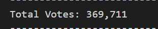
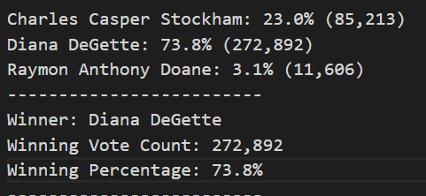
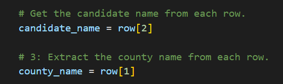
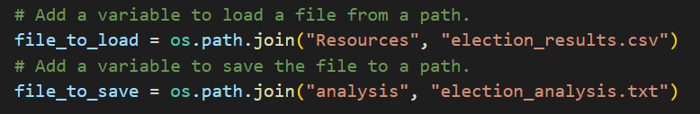

# ElectionAnalysis

## Project Overview
The Colorado Board of Elections has requested an election audit on a congressional election.

1. Calculate the total voter turnout
2. From total voter turnout, calculate the percentage of votes from each county
3. Calculate the total number of votes each candidate received
4. Calculate the percentage of votes each candidate won
5. Determine the county with the largest voter turnout
6. Determine the winner of the election based on popular vote

## Resources
An 'election_results.csv' file

## Election-Audit Results
The analysis of the election show that:
 - There were 369,711 votes cast in the election
 
 
 - The candidates were:
    - Charles Casper Stockham
    - Diana DeGette
    - Raymon Anthony Doane
 - The candidate results were:
    - Charles Casper Stockham received 23.0% of the vote and 85,123 number of votes
    - Diana DeGette received 73.8% of the vote and 272,892 number of votes
    - Raymon Anthony Doane received 3.1% of the vote and 11,606 number of votes
 - The election winner was:
    - Diana DeGette, who receive 73.8% of the vote and 272,892 number of votes
 
 
 - The counties that voted were:
    - Jefferson
    - Denver
    - Arapahoe
 - The county results for voter turnout were:
    - 38, 855 number of votes or 10.5% of the vote came from Jefferson county
    - 306,055 number of votes or 82.8% of the vote came from Denver county
    - 24,801 number of votes or 6.7% of the vote came from Arapahoe county
 - The county with the largest voter turnout was:
    - Denver had the largest voter turnout with 82.8% of the vote and 306,055 number of votes
 
 

## Election-Audit Summary
This script is open ended and can be used for other government elections, all the variables are linked in the file, after slight modification to fit the new election result file the script can be utilized effectively.

Change the row number to extract the candidate and county name.

Change the file path depending on if it is direct/indrect and how/where the file is stored

