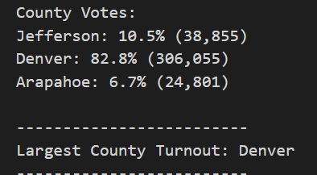

# Election_Analysis

<!-- TABLE OF CONTENTS -->

  
Table of Contents

  <ol>
    <li>
      <a href="#Purpose">Purpose</a>
      <ul>
        <li><a href="#Source-Data">Source Data</a></li>
      </ul>
    </li>
    <li>
      <a href="#Results">Results</a>
      <ul>
        <li><a href="#Ratio-of-Rides-to-Drivers">Ratio of Rides to Drivers</a></li>
        <li><a href="#Average-Fare-per-Ride">Average Fare per Ride</a></li>
        <li><a href="#Average-Fare-per-Driver">Average Fare per Driver</a></li>
        <li><a href="#Total-Fares">Total Fares</a></li>
      </ul>
    </li>
    <li><a href="#Conclusion">Conclusion</a></li>
    <li><a href="#Summary">Summary</a></li>
    <li><a href="#Contact">Contact</a></li>
  </ol>

## Purpose

# Election_Analysis

## Project Overview
A Colorado Board of Elections employee has given you the following tasks to complete the election audit of a recent local congressional election.

The purpose of this data analysis was to extract data from a .cvs file to:  
  1) Calculate the total number of votes cast
  2) Get a complete list of candidates who recevied votes
  3) Calculate the total number of votes each candidate received
  4) Calculate the percentage of votes each candidate won
  5) Determine the winner of the election based on popular vote
  6) Determine the county with the largest voter turnout
 
## Results
The analysis of the election show that:
 - There were 369,711 votes cast in the election
 
 
 - The candidates were:
    - Charles Casper Stockham
    - Diana DeGette
    - Raymon Anthony Doane
 - The candidate results were:
    - Charles Casper Stockham received 23.0% of the vote and 85,123 number of votes
    - Diana DeGette received 73.8% of the vote and 272,892 number of votes
    - Raymon Anthony Doane received 3.1% of the vote and 11,606 number of votes
 
 
 - The counties that voted were:
    - Jefferson
    - Denver
    - Arapahoe
 - The county results for voter turnout were:
    - 38, 855 number of votes or 10.5% of the vote came from Jefferson county
    - 306,055 number of votes or 82.8% of the vote came from Denver county
    - 24,801 number of votes or 6.7% of the vote came from Arapahoe county
 - The county with the largest voter turnout was:
    - Denver had the largest voter turnout with 82.8% of the vote and 306,055 number of votes
 
 
 
 ## Conclusion
1. The winner of the election was: Diana DeGette,the largest turnout
2. Denver had the largest voter turnout

## Summary
This script can be used for any election. The variables are not linked to anything outside of the file, therefore after the following modifications have been done to fit the new election result file the script should run the same.

An item that might need to be changed is the row number to extract the candidate and county name.

Another item that may need a modification is the file path. This will be modified depending on how and where the file is stored, or if the path is direct or indirect.

## Contact
Huzaifa Hussain | https://www.linkedin.com/in/huzaifa-s-hussain/

